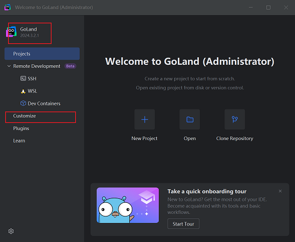
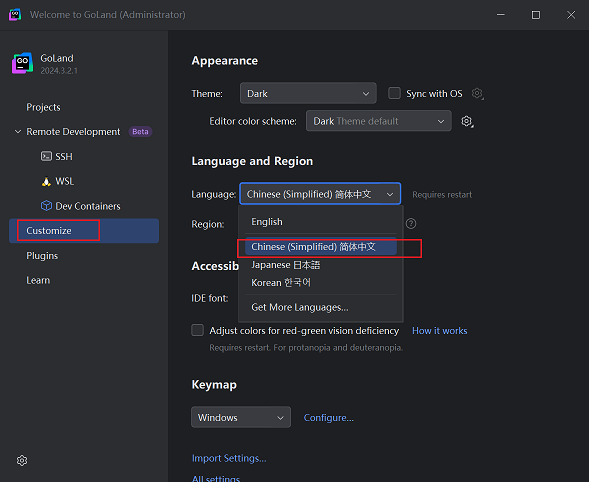
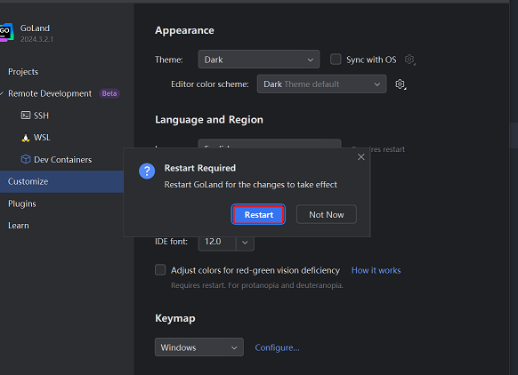
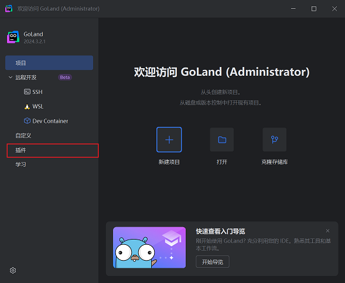
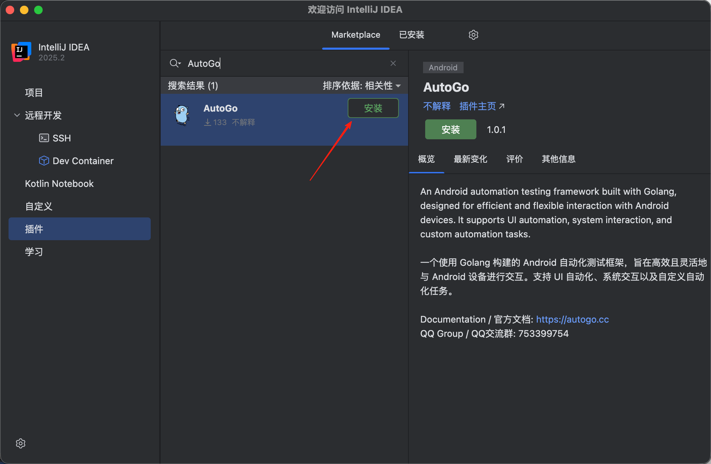
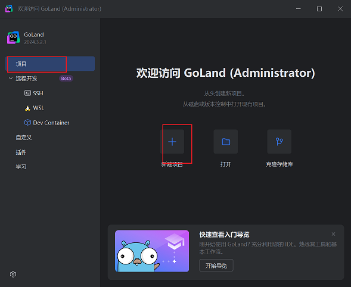
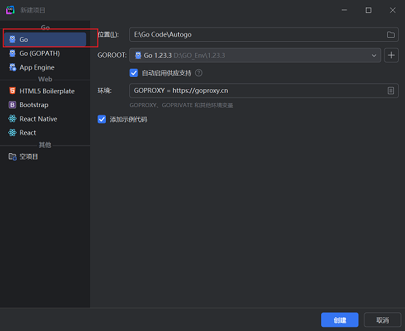
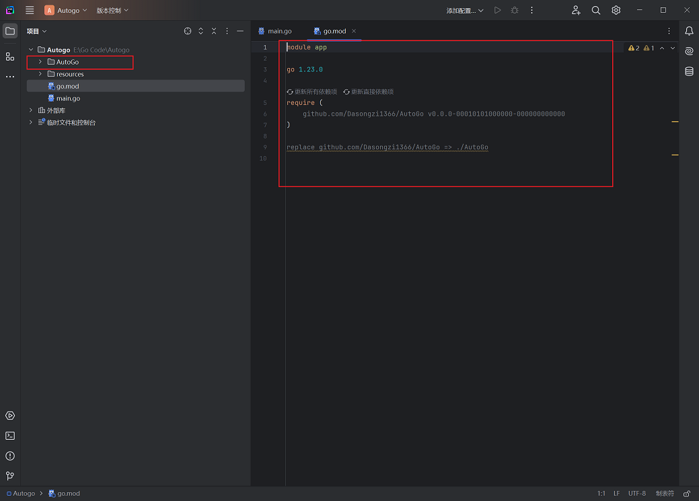
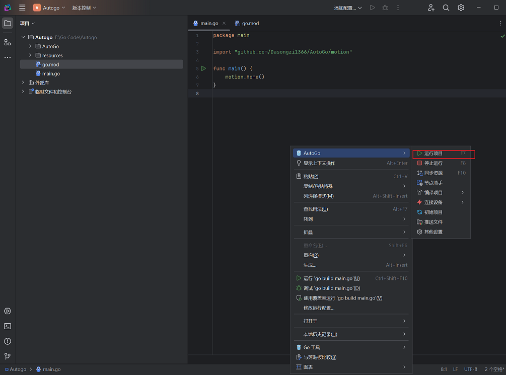

# 简介

**AutoGo** 是一个基于 Go 语言开发的 Android 自动化操作工具，旨在为用户提供一个高效、安全、灵活的 Android 自动化解决方案。与传统的自动化工具不同，AutoGo 的二进制执行文件能够在 Android 系统上直接运行，具备强大的跨应用操作能力，同时无需安装任何 APK。这使得它在复杂的自动化场景中，尤其是在需要与其他应用无缝交互时，具有独特的优势。

### QQ交流群:753399754&nbsp;&nbsp;&nbsp;<a href="https://qm.qq.com/q/mHAHFlgtXi" target="_blank" style="font-size:15px;">点击加入</a>

### 为什么选择 AutoGo？

- **非侵入式架构**：AutoGo 不依赖于任何 APK 安装，通过 ADB 或 root 权限的 shell 即可在 Android 系统中运行，无需其他任何权限。
- **高安全性**：AutoGo 编译为 Android 可执行的二进制文件，有效防止逆向工程极大地提高了程序的安全性和防破解能力。
- **可扩展性强**：开发者可以通过 Go 语言编写自定义脚本，利用丰富的内置 API 以及各种 Go 开源库实现高度定制化的自动化流程。
- **集成与兼容性**：支持在任意 Android 应用中通过 shell 权限集成运行，无论是作为独立工具使用，还是作为其他应用的一部分嵌入，均能发挥其强大的自动化功能。
- **灵活的开发模式**：用户通过 Go 语言编写自动化脚本，充分利用 Go 语言的高并发和高效特性，快速实现复杂的自动化任务。
- **丰富的功能模块**：从应用层的辅助功能控制到系统级别的命令执行，AutoGo 涵盖了 Android 系统操作的方方面面，几乎可以满足所有自动化场景的需求。

### 适用场景

- **应用自动化测试**：开发者可以通过 AutoGo 编写自动化脚本，测试应用的功能、性能和兼容性。
- **跨应用操作**：实现应用之间的无缝交互操作，比如自动化测试跨多个应用的场景。
- **高安全性要求的自动化**：需要防止被逆向破解的自动化脚本，例如涉及敏感操作的自动化流程。
- **内置集成**：AutoGo 可以嵌入到其他 Android 应用中，提供自动化能力，为复杂的应用开发提供强有力的支持。

### 安装指南

**1. 安装 IDE 开发工具：推荐使用 [GoLand](https://www.jetbrains.com/go/download/) 或 [IDEA](https://www.jetbrains.com/idea/download/)**

**2. 安装 [AutoGo](http://jgw.52ailin.com:7001/files/AutoGo/AutoGo-JetBrains-1.0.5.zip) 插件**



注意新版本的goland 不用安装中文插件 Customize 中可以直接设置



改了之后要求我们重启 我们点击 restart 重启即可



重启之后 我们可以看到 回到了熟悉的中文界面 点击插件管理 点击设置 点击 从磁盘安装插件



搜索 AutoGo 点击 安装 即可



重启之后 我们可以看到 插件已经安装成功了

**3. 初始化项目：**
我们新建一个项目 点击创建





点击检查更新下载最新版本SDK


设置adb路径  右键选择插件 点击 其他设置


点击 确定 即可
初始化项目 右键选择插件 点击 初始化项目


看到了 我们的项目已经初始化成功了



**4. 编写第一个项目：**
打开mian.go 文件 CTRL + a 全选 删除掉
粘贴以下代码

```go
package main

import "github.com/Dasongzi1366/AutoGo/motion"

func main() {
	motion.Home(0)  // 回到主界面
}
```

打开一个模拟器或其连接真机设备 确保使用 adb devices 可以找到设备
使用快捷键F7 或者 点击运行 即可运行项目

